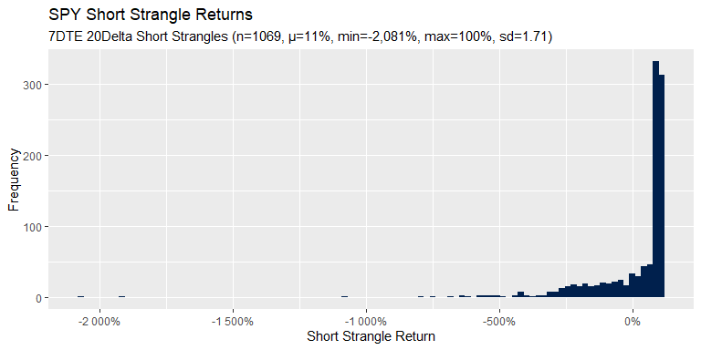
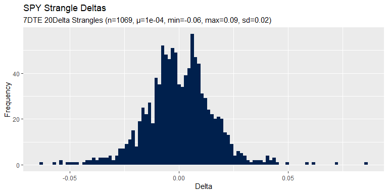
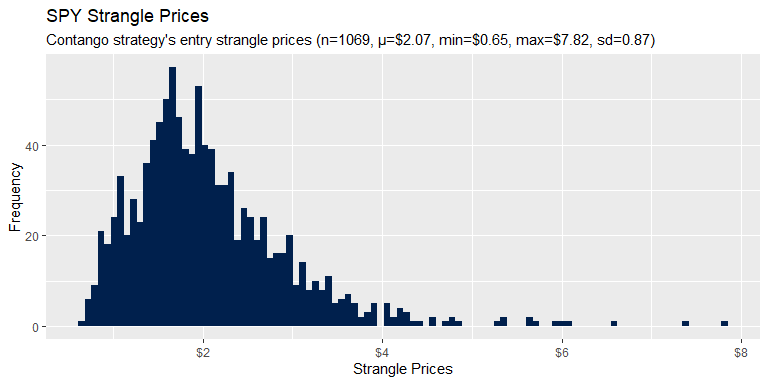
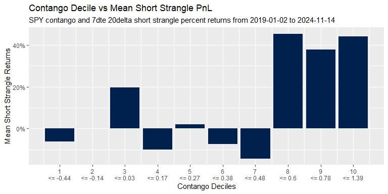
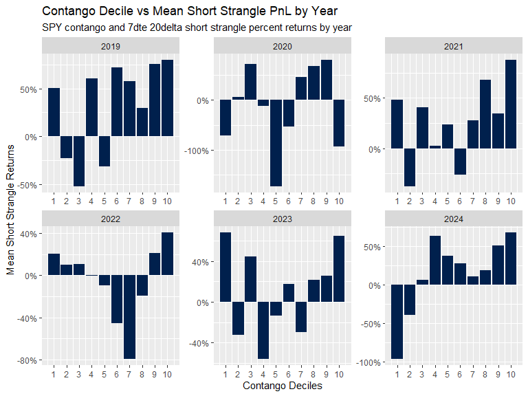
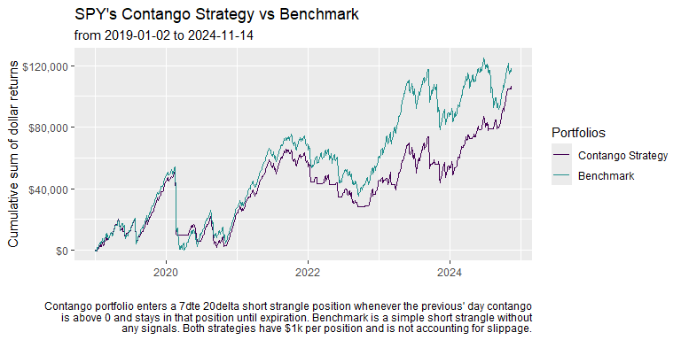

Contango Strategy
================
Ned H
2024-12-15

- [Setup](#setup)
  - [Dependencies](#dependencies)
  - [Load Strangle Data](#load-strangle-data)
  - [Query Contango Data](#query-contango-data)
  - [Join tables into a base table](#join-tables-into-a-base-table)
- [Exploratory Data Analysis](#exploratory-data-analysis)
  - [Short Strangle Returns](#short-strangle-returns)
  - [Strangle Deltas](#strangle-deltas)
  - [Strangle Prices](#strangle-prices)
  - [Contango](#contango)
- [Decile Analysis](#decile-analysis)
  - [Total](#total)
  - [Across Years](#across-years)
- [Strategy Comparisons](#strategy-comparisons)
  - [Contango Strategy vs Benchmark](#contango-strategy-vs-benchmark)
  - [Summary Table](#summary-table)

## Setup

### Dependencies

``` r
library(gt)
library(tidyverse)
```

### Load Strangle Data

Ran [this big query sql script](scripts/bq-spy-strangle-query.sql) to
calculate strangle prices from SPY options.

``` r
# Read the data
bq_strangle_tbl <- read_csv(
    file = "apps/contango-strategy/data/bq-strangle-tbl.csv",
    show_col_types = FALSE
)

bq_strangle_tbl |>
    head(3)
```

<div class="kable-table">

<table>

<thead>

<tr>

<th style="text-align:left;">

call_id
</th>

<th style="text-align:left;">

put_id
</th>

<th style="text-align:left;">

date_entry
</th>

<th style="text-align:left;">

date_exit
</th>

<th style="text-align:left;">

expiration
</th>

<th style="text-align:right;">

dte
</th>

<th style="text-align:right;">

stock_price_entry
</th>

<th style="text-align:right;">

stock_price_exit
</th>

<th style="text-align:right;">

call_delta_entry
</th>

<th style="text-align:right;">

put_delta_entry
</th>

<th style="text-align:right;">

strangle_price_entry
</th>

<th style="text-align:right;">

strangle_price_exit
</th>

<th style="text-align:right;">

short_strangle_dollar_pnl
</th>

<th style="text-align:right;">

short_strangle_pct_pnl
</th>

</tr>

</thead>

<tbody>

<tr>

<td style="text-align:left;">

SPY190109C00255000
</td>

<td style="text-align:left;">

SPY190109P00242000
</td>

<td style="text-align:left;">

2019-01-02
</td>

<td style="text-align:left;">

2019-01-09
</td>

<td style="text-align:left;">

2019-01-09
</td>

<td style="text-align:right;">

7
</td>

<td style="text-align:right;">

249.42
</td>

<td style="text-align:right;">

257.71
</td>

<td style="text-align:right;">

0.20508
</td>

<td style="text-align:right;">

-0.18962
</td>

<td style="text-align:right;">

1.700
</td>

<td style="text-align:right;">

2.815
</td>

<td style="text-align:right;">

-1.115
</td>

<td style="text-align:right;">

-0.6559
</td>

</tr>

<tr>

<td style="text-align:left;">

SPY190111C00258000
</td>

<td style="text-align:left;">

SPY190111P00246000
</td>

<td style="text-align:left;">

2019-01-04
</td>

<td style="text-align:left;">

2019-01-11
</td>

<td style="text-align:left;">

2019-01-11
</td>

<td style="text-align:right;">

7
</td>

<td style="text-align:right;">

252.25
</td>

<td style="text-align:right;">

258.88
</td>

<td style="text-align:right;">

0.19767
</td>

<td style="text-align:right;">

-0.20883
</td>

<td style="text-align:right;">

1.705
</td>

<td style="text-align:right;">

0.885
</td>

<td style="text-align:right;">

0.820
</td>

<td style="text-align:right;">

0.4809
</td>

</tr>

<tr>

<td style="text-align:left;">

SPY190114C00260000
</td>

<td style="text-align:left;">

SPY190114P00249000
</td>

<td style="text-align:left;">

2019-01-07
</td>

<td style="text-align:left;">

2019-01-14
</td>

<td style="text-align:left;">

2019-01-14
</td>

<td style="text-align:right;">

7
</td>

<td style="text-align:right;">

254.93
</td>

<td style="text-align:right;">

257.71
</td>

<td style="text-align:right;">

0.21437
</td>

<td style="text-align:right;">

-0.20752
</td>

<td style="text-align:right;">

1.650
</td>

<td style="text-align:right;">

0.010
</td>

<td style="text-align:right;">

1.640
</td>

<td style="text-align:right;">

0.9939
</td>

</tr>

</tbody>

</table>

</div>

<!-- 
##  Inspecting bq_strangle_tbl
# spc_tbl_ [1,069 x 14] (S3: spec_tbl_df/tbl_df/tbl/data.frame)
#  $ call_id                  : chr [1:1069] "SPY190109C00255000" ...
#  $ put_id                   : chr [1:1069] "SPY190109P00242000" ...
#  $ date_entry               : Date[1:1069], format: "2019-01-02" ...
#  $ date_exit                : Date[1:1069], format: "2019-01-09" ...
#  $ expiration               : Date[1:1069], format: "2019-01-09" ...
#  $ dte                      : num [1:1069] 7 7 ...
#  $ stock_price_entry        : num [1:1069] 249 ...
#  $ stock_price_exit         : num [1:1069] 258 ...
#  $ call_delta_entry         : num [1:1069] 0.205 ...
#  $ put_delta_entry          : num [1:1069] -0.19 ...
#  $ strangle_price_entry     : num [1:1069] 1.7 ...
#  $ strangle_price_exit      : num [1:1069] 2.81 ...
#  $ short_strangle_dollar_pnl: num [1:1069] -1.11 ...
#  $ short_strangle_pct_pnl   : num [1:1069] -0.656 ...
 -->

### Query Contango Data

Query contango data from [ORATS
hist/cores](https://orats.com/docs/historical-data-api) end-point.

``` r
# Contango response
contango_res <- read_csv(
    sprintf(
        "https://api.orats.io/datav2/hist/cores.csv?token=%s&ticker=SPY&fields=ticker,tradeDate,contango",
        Sys.getenv("ORATS_API")
    ),
    show_col_types = FALSE
)

# Lag contango by 1 day to prevent forward-looking analysis
contango_tbl <- contango_res |>
    rename("tradedate" = tradeDate) |>
    arrange(tradedate) |>
    mutate(lagged_contango = lag(contango))

contango_tbl |>
    head(3)
```

<div class="kable-table">

<table>

<thead>

<tr>

<th style="text-align:left;">

ticker
</th>

<th style="text-align:left;">

tradedate
</th>

<th style="text-align:right;">

contango
</th>

<th style="text-align:right;">

lagged_contango
</th>

</tr>

</thead>

<tbody>

<tr>

<td style="text-align:left;">

SPY
</td>

<td style="text-align:left;">

2007-01-03
</td>

<td style="text-align:right;">

0.48
</td>

<td style="text-align:right;">

</td>

</tr>

<tr>

<td style="text-align:left;">

SPY
</td>

<td style="text-align:left;">

2007-01-04
</td>

<td style="text-align:right;">

0.55
</td>

<td style="text-align:right;">

0.48
</td>

</tr>

<tr>

<td style="text-align:left;">

SPY
</td>

<td style="text-align:left;">

2007-01-05
</td>

<td style="text-align:right;">

0.33
</td>

<td style="text-align:right;">

0.55
</td>

</tr>

</tbody>

</table>

</div>

<!--
## Inspecting contango_tbl  
&#10;tibble [4,509 x 4] (S3: tbl_df/tbl/data.frame)
 $ ticker         : chr [1:4509] "SPY" ...
 $ tradedate      : Date[1:4509], format: "2007-01-03" ...
 $ contango       : num [1:4509] 0.48 0.55 ...
 $ lagged_contango: num [1:4509] NA 0.48 ...
 -->

### Join tables into a base table

Joining the contango and strangle prices tables to start doing more
complicated analysis.

``` r
base_tbl <- bq_strangle_tbl |>
    left_join(contango_tbl[, c("tradedate", "lagged_contango")], by = c("date_entry" = "tradedate")) |>
    drop_na(lagged_contango)

# write_csv(base_tbl, "data/base-tbl.csv")

# Create date ranges
from_date <- min(base_tbl$date_entry) # 2019-01-02
to_date <- max(base_tbl$date_entry) # 2024-11-14

base_tbl |>
    head(3)
```

<div class="kable-table">

<table>

<thead>

<tr>

<th style="text-align:left;">

call_id
</th>

<th style="text-align:left;">

put_id
</th>

<th style="text-align:left;">

date_entry
</th>

<th style="text-align:left;">

date_exit
</th>

<th style="text-align:left;">

expiration
</th>

<th style="text-align:right;">

dte
</th>

<th style="text-align:right;">

stock_price_entry
</th>

<th style="text-align:right;">

stock_price_exit
</th>

<th style="text-align:right;">

call_delta_entry
</th>

<th style="text-align:right;">

put_delta_entry
</th>

<th style="text-align:right;">

strangle_price_entry
</th>

<th style="text-align:right;">

strangle_price_exit
</th>

<th style="text-align:right;">

short_strangle_dollar_pnl
</th>

<th style="text-align:right;">

short_strangle_pct_pnl
</th>

<th style="text-align:right;">

lagged_contango
</th>

</tr>

</thead>

<tbody>

<tr>

<td style="text-align:left;">

SPY190109C00255000
</td>

<td style="text-align:left;">

SPY190109P00242000
</td>

<td style="text-align:left;">

2019-01-02
</td>

<td style="text-align:left;">

2019-01-09
</td>

<td style="text-align:left;">

2019-01-09
</td>

<td style="text-align:right;">

7
</td>

<td style="text-align:right;">

249.42
</td>

<td style="text-align:right;">

257.71
</td>

<td style="text-align:right;">

0.20508
</td>

<td style="text-align:right;">

-0.18962
</td>

<td style="text-align:right;">

1.700
</td>

<td style="text-align:right;">

2.815
</td>

<td style="text-align:right;">

-1.115
</td>

<td style="text-align:right;">

-0.6559
</td>

<td style="text-align:right;">

-0.65
</td>

</tr>

<tr>

<td style="text-align:left;">

SPY190111C00258000
</td>

<td style="text-align:left;">

SPY190111P00246000
</td>

<td style="text-align:left;">

2019-01-04
</td>

<td style="text-align:left;">

2019-01-11
</td>

<td style="text-align:left;">

2019-01-11
</td>

<td style="text-align:right;">

7
</td>

<td style="text-align:right;">

252.25
</td>

<td style="text-align:right;">

258.88
</td>

<td style="text-align:right;">

0.19767
</td>

<td style="text-align:right;">

-0.20883
</td>

<td style="text-align:right;">

1.705
</td>

<td style="text-align:right;">

0.885
</td>

<td style="text-align:right;">

0.820
</td>

<td style="text-align:right;">

0.4809
</td>

<td style="text-align:right;">

-0.41
</td>

</tr>

<tr>

<td style="text-align:left;">

SPY190114C00260000
</td>

<td style="text-align:left;">

SPY190114P00249000
</td>

<td style="text-align:left;">

2019-01-07
</td>

<td style="text-align:left;">

2019-01-14
</td>

<td style="text-align:left;">

2019-01-14
</td>

<td style="text-align:right;">

7
</td>

<td style="text-align:right;">

254.93
</td>

<td style="text-align:right;">

257.71
</td>

<td style="text-align:right;">

0.21437
</td>

<td style="text-align:right;">

-0.20752
</td>

<td style="text-align:right;">

1.650
</td>

<td style="text-align:right;">

0.010
</td>

<td style="text-align:right;">

1.640
</td>

<td style="text-align:right;">

0.9939
</td>

<td style="text-align:right;">

-0.02
</td>

</tr>

</tbody>

</table>

</div>

## Exploratory Data Analysis

### Short Strangle Returns

``` r
# Summary table for subtitle
base_summary_tbl <- base_tbl |>
    select(short_strangle_pct_pnl) |>
    summarize(
        mean = mean(short_strangle_pct_pnl),
        min = min(short_strangle_pct_pnl),
        max = max(short_strangle_pct_pnl),
        sd = round(sd(short_strangle_pct_pnl), 2),
        n = n()
    ) |>
    mutate(across(mean:max, function(x) scales::percent(x, big.mark = ",")))

base_tbl |>
    ggplot(aes(x = short_strangle_pct_pnl, fill = "name")) +
    geom_histogram(bins = 100) +
    scale_x_continuous(labels = scales::percent) +
    scale_fill_manual(
        # values = nedhmn_palette
        values = viridis::viridis(1, option = "E")
    ) +
    labs(
        title = "SPY Short Strangle Returns",
        subtitle = sprintf(
            "7DTE 20Delta Short Strangles (n=%s, µ=%s, min=%s, max=%s, sd=%s)",
            base_summary_tbl$n,
            base_summary_tbl$mean,
            base_summary_tbl$min,
            base_summary_tbl$max,
            base_summary_tbl$sd
        ) |>
            str_wrap(90),
        x = "Short Strangle Return",
        y = "Frequency"
    ) +
    # nedhmn_theme()
    theme(legend.position = "none")
```

<!-- -->

``` r
# ggsave("apps/contango-strategy/assets/blog-strangle-returns-distribution.png", width = 8, height = 4)
```

### Strangle Deltas

``` r
delta_tbl <- base_tbl |>
    mutate(strangle_delta = call_delta_entry + put_delta_entry) |>
    select(strangle_delta)

delta_summaries <- delta_tbl |>
    summarize(
        n = n(),
        mean = round(mean(strangle_delta), 4),
        sd = sd(strangle_delta),
        min = min(strangle_delta),
        max = max(strangle_delta)
    ) |>
    mutate(across(sd:max, function(x) round(x, 2)))

delta_tbl |>
    ggplot(aes(x = strangle_delta, fill = "SPY")) +
    geom_histogram(bins = 100) +
    scale_fill_manual(
        values = viridis::viridis(1, option = "E")
        # values = nedhmn_palette
    ) +
    labs(
        title = "SPY Strangle Deltas",
        subtitle = sprintf(
            "7DTE 20Delta Strangles (n=%s, µ=%s, min=%s, max=%s, sd=%s)",
            delta_summaries$n,
            delta_summaries$mean,
            delta_summaries$min,
            delta_summaries$max,
            delta_summaries$sd
        ) |>
            str_wrap(width = 80),
        x = "Delta",
        y = "Frequency"
    ) +
    # nedhmn_theme()
    theme(legend.position = "none")
```

<!-- -->

``` r
# ggsave("apps/contango-strategy/assets/blog-strangle-deltas-distribution.png", width = 8, height = 4)
```

### Strangle Prices

``` r
price_summaries <- base_tbl |>
    select(strangle_price_entry) |>
    summarize(
        n = n(),
        mean = mean(strangle_price_entry),
        sd = round(sd(strangle_price_entry), 2),
        min = min(strangle_price_entry),
        max = max(strangle_price_entry)
    ) |>
    mutate(across(c(mean, min, max), function(x) scales::dollar(round(x, 2))))

base_tbl |>
    select(date_entry, strangle_price_entry) |>
    ggplot(aes(x = strangle_price_entry, fill = "name")) +
    geom_histogram(bins = 100) +
    scale_x_continuous(labels = scales::dollar) +
    scale_fill_manual(
        values = viridis::viridis(1, option = "E")
        # values = nedhmn_palette
    ) +
    labs(
        title = "SPY Strangle Prices",
        subtitle = sprintf(
            "Contango strategy's entry strangle prices (n=%s, µ=%s, min=%s, max=%s, sd=%s)",
            price_summaries$n,
            price_summaries$mean,
            price_summaries$min,
            price_summaries$max,
            price_summaries$sd
        ),
        x = "Strangle Prices",
        y = "Frequency"
    ) +
    # nedhmn_theme()
    theme(legend.position = "none")
```

<!-- -->

``` r
# ggsave("apps/contango-strategy/assets/blog-strangle-prices-distribution.png", width = 8, height = 4)
```

### Contango

TODO

``` r
# TODO
```

## Decile Analysis

### Total

``` r
# First, calculate the max values per bucket and store them
bucket_maxes <- base_tbl |>
    mutate(contango_ntile = ntile(lagged_contango, 10)) |>
    group_by(contango_ntile) |>
    summarize(max_contango = max(lagged_contango))

# Now create the plot with custom labels
base_tbl |>
    mutate(contango_ntile = ntile(lagged_contango, 10)) |>
    group_by(contango_ntile) |>
    summarize(mean_pnl = mean(short_strangle_pct_pnl)) |>
    ggplot(aes(x = contango_ntile, y = mean_pnl, fill = "deciles")) +
    geom_col() +
    scale_y_continuous(labels = scales::percent) +
    scale_x_continuous(
        breaks = 1:10,
        labels = function(x) {
            # Create two-line labels using the stored max values
            paste0(x, "\n<= ", round(bucket_maxes$max_contango[x], 2))
        }
    ) +
    scale_fill_manual(
        values = viridis::viridis(1, option = "E")
        # values = nedhmn_palette
    ) +
    labs(
        title = "Contango Decile vs Mean Short Strangle PnL",
        subtitle = sprintf(
            "SPY contango and 7dte 20delta short strangle percent returns from %s to %s",
            from_date,
            to_date
        ),
        x = "Contango Deciles",
        y = "Mean Short Strangle Returns"
    ) +
    # nedhmn_theme()
    theme(legend.position = "none")
```

<!-- -->

``` r
# ggsave("apps/contango-strategy/assets/blog-contango-deciles-total.png", width = 8, height = 4)
```

### Across Years

``` r
base_tbl |>
    mutate(year = year(date_entry)) |>
    group_by(year) |>
    mutate(contango_ntile = ntile(lagged_contango, 10)) |>
    group_by(year, contango_ntile) |>
    summarize(mean_pnl = mean(short_strangle_pct_pnl)) |>
    ggplot(aes(x = contango_ntile, y = mean_pnl, group = year, fill = "name")) +
    geom_col() +
    scale_y_continuous(labels = scales::percent) +
    scale_x_continuous(breaks = 1:10) +
    scale_fill_manual(
        values = viridis::viridis(1, option = "E")
        # values = nedhmn_palette
    ) +
    labs(
        title = "Contango Decile vs Mean Short Strangle PnL by Year",
        subtitle = "SPY contango and 7dte 20delta short strangle percent returns by year",
        x = "Contango Deciles",
        y = "Mean Short Strangle Returns"
    ) +
    facet_wrap(~year, scales = "free") +
    # nedhmn_theme()
    theme(legend.position = "none")
```

<!-- -->

``` r
# ggsave("apps/contango-strategy/assets/blog-contango-deciles-years.png", width = 8, height = 6)
```

## Strategy Comparisons

### Contango Strategy vs Benchmark

``` r
portfolios_tbl <- base_tbl |>
    filter(lagged_contango > 0) |>
    select(date_entry, contains("_pnl"), lagged_contango) |>
    rename_all(function(x) str_replace(x, "short_strangle", "contango_strat")) |>
    select(-lagged_contango) |>
    right_join(base_tbl |>
        select(date_entry, contains("_pnl"), lagged_contango), by = "date_entry") |>
    arrange(date_entry) |>
    mutate(
        # For days that we aren't in the trade, replacing NA's with 0
        across(contains("contango_strat"), function(x) ifelse(is.na(x), 0, x)),
        across(contains("pnl"), function(x) cumsum(x), .names = "cum_{.col}")
    ) |>
    select(date_entry, lagged_contango, contains("contango_strat"), contains("short_strangle")) |>
    # Multiplying percent returns by $1k
    mutate(across(c("cum_contango_strat_pct_pnl", "cum_short_strangle_pct_pnl"), function(x) x * 1000, .names = "{.col}_1k"))

portfolios_tbl |>
    select(date_entry, cum_contango_strat_pct_pnl_1k, cum_short_strangle_pct_pnl_1k) |>
    pivot_longer(2:3) |>
    arrange(name, date_entry) |>
    mutate(zindex = ifelse(name == "cum_contango_strat_pct_pnl_1k", 1, 0)) |>
    ggplot(aes(x = date_entry, y = value, color = name, zindex = zindex)) +
    geom_line() +
    scale_y_continuous(labels = scales::dollar) +
    labs(
        title = "SPY's Contango Strategy vs Benchmark",
        subtitle = sprintf("from %s to %s", min(portfolios_tbl$date_entry), max(portfolios_tbl$date_entry)),
        x = "",
        y = "Cumulative sum of dollar returns",
        caption = str_wrap(
            "Contango portfolio enters a 7dte 20delta short strangle position whenever the previous' day contango is above 0 and stays in that position until expiration. Benchmark is a simple short strangle without any signals. Both strategies have $1k per position and is not accounting for slippage.",
            width = 100
        ),
        color = "Portfolios"
    ) +
    scale_color_manual(
        values = viridis::viridis(3)[c(1, 2)],
        # values = nedhmn_palette[c(1, 3)],
        labels = c("cum_contango_strat_pct_pnl_1k" = "Contango Strategy", "cum_short_strangle_pct_pnl_1k" = "Benchmark")
    ) # + nedhmn_theme(show_legend = TRUE)
```

<!-- -->

``` r
# ggsave("apps/contango-strategy/assets/blog-cumulative-portfolios.png", height = 4, width = 8)
```

<!-- Saving Data -->

### Summary Table

``` r
summary_tbl <- portfolios_tbl |>
    reframe(
        date_entry,
        contango_strat_pct_pnl_1k = contango_strat_pct_pnl * 1000,
        short_strangle_pct_pnl_1k = short_strangle_pct_pnl * 1000,
        lagged_contango
    ) |>
    pivot_longer(contains("pnl")) |>
    # Filter out non-trade days for contango strategy so that it
    # doesn't bias the volatility, median, mean, or count.
    filter(!(name == "contango_strat_pct_pnl_1k" & lagged_contango <= 0)) |>
    arrange(name, date_entry) |>
    drop_na(value) |>
    group_by(name) |>
    reframe(
        total_dollar_pnl = sum(value),
        lowest_dollar_pnl = min(value),
        median_dollar_pnl = median(value),
        mean_dollar_pnl = mean(value),
        stdev = round(sd(value / 1000), 2),
        trades = n()
    ) |>
    mutate(
        name = c("Contango Strategy", "Benchmark"),
        across(contains("dollar"), function(x) scales::dollar(x))
    ) |>
    rename(
        " " = name,
        "Total PnL" = total_dollar_pnl,
        "Max Loss" = lowest_dollar_pnl,
        "Median Return" = median_dollar_pnl,
        "Mean Return" = mean_dollar_pnl,
        "StdDev" = stdev,
        "Trades" = trades
    ) |>
    arrange(` `)

summary_tbl
```

<div class="kable-table">

<table>

<thead>

<tr>

<th style="text-align:left;">

</th>

<th style="text-align:left;">

Total PnL
</th>

<th style="text-align:left;">

Max Loss
</th>

<th style="text-align:left;">

Median Return
</th>

<th style="text-align:left;">

Mean Return
</th>

<th style="text-align:right;">

StdDev
</th>

<th style="text-align:right;">

Trades
</th>

</tr>

</thead>

<tbody>

<tr>

<td style="text-align:left;">

Benchmark
</td>

<td style="text-align:left;">

\$118,134
</td>

<td style="text-align:left;">

-\$20,814
</td>

<td style="text-align:left;">

\$970.40
</td>

<td style="text-align:left;">

\$110.51
</td>

<td style="text-align:right;">

1.71
</td>

<td style="text-align:right;">

1069
</td>

</tr>

<tr>

<td style="text-align:left;">

Contango Strategy
</td>

<td style="text-align:left;">

\$106,834
</td>

<td style="text-align:left;">

-\$20,814
</td>

<td style="text-align:left;">

\$972.60
</td>

<td style="text-align:left;">

\$139.65
</td>

<td style="text-align:right;">

1.78
</td>

<td style="text-align:right;">

765
</td>

</tr>

</tbody>

</table>

</div>

<!-- Saving Table -->
