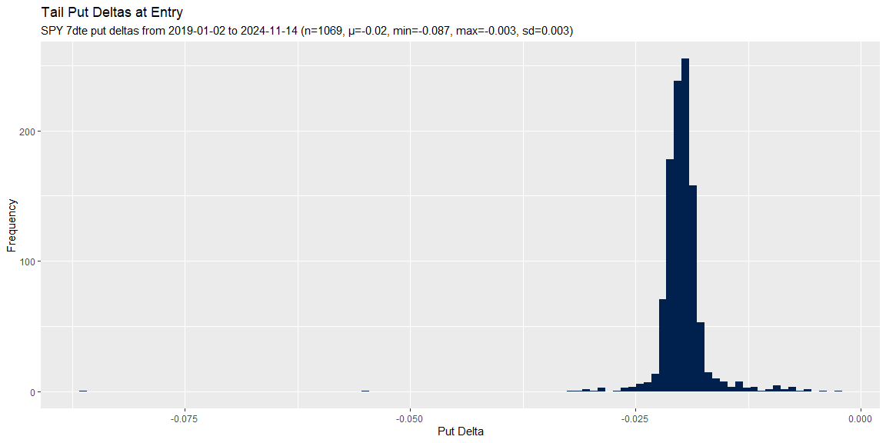
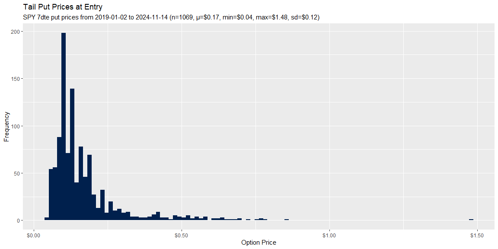
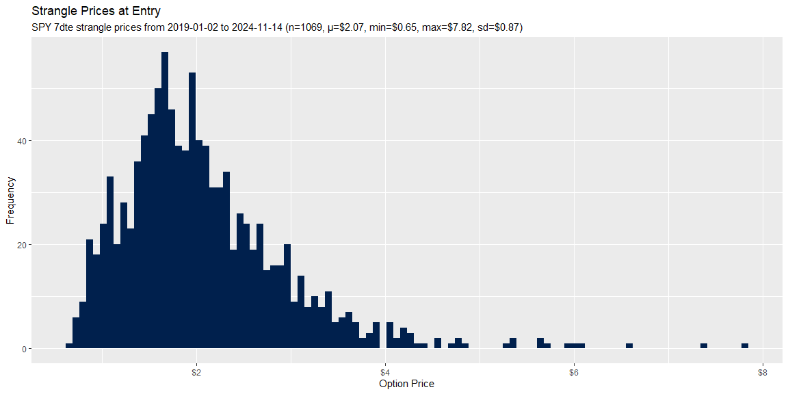
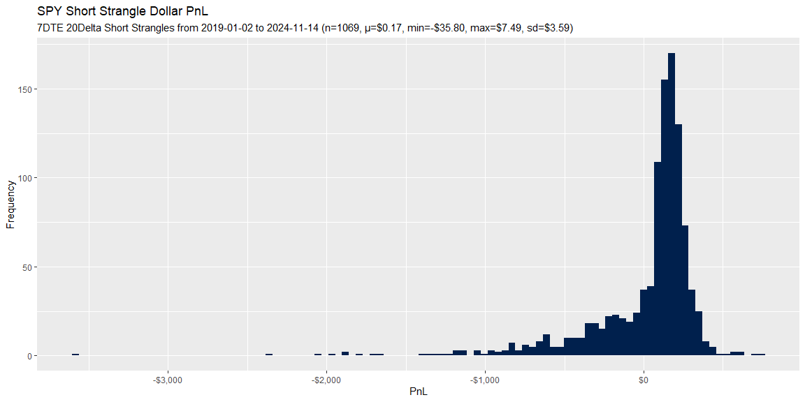
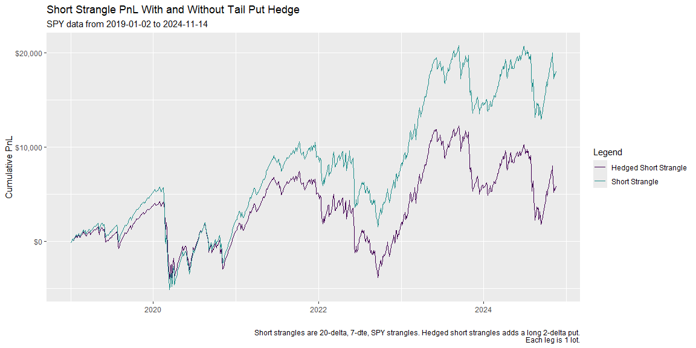
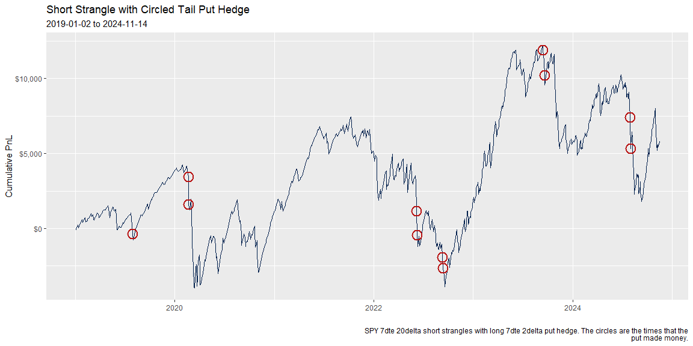

Using 2Delta Puts to Hedge Short Strangles
================
Ned H
2024-12-15

- [Setup](#setup)
  - [Dependencies](#dependencies)
  - [Query base strangle data from big
    query](#query-base-strangle-data-from-big-query)
  - [Calculate PnLs](#calculate-pnls)
- [Exploratory Data Analysis](#exploratory-data-analysis)
  - [Tail Put Validation](#tail-put-validation)
  - [Short Strangles Delta](#short-strangles-delta)
  - [Tail Puts Delta](#tail-puts-delta)
  - [Short Strangle PnL](#short-strangle-pnl)
  - [Long Tail Put PnL](#long-tail-put-pnl)
  - [Put Percent Of Short Strangles](#put-percent-of-short-strangles)
- [Comparison Analysis](#comparison-analysis)
  - [Summary Statistics](#summary-statistics)
  - [Hedged Short Strangle vs Short
    Strangle](#hedged-short-strangle-vs-short-strangle)
- [Hedged Short Strangle Strategy](#hedged-short-strangle-strategy)
  - [Circle Trades When Tail Put Made
    Money](#circle-trades-when-tail-put-made-money)

## Setup

### Dependencies

``` r
library(tidyverse)

source("packages/utils/aesthetics.R")
```

### Query base strangle data from big query

``` r
bq_tbl <- read_csv(
    file = "apps/spy-strangles-with-put-hedge/data/bq-strangles-data.csv",
    show_col_types = FALSE
)

bq_tbl |>
    head(3)
```

<div class="kable-table">

<table>

<thead>

<tr>

<th style="text-align:left;">

call_id
</th>

<th style="text-align:left;">

put_id
</th>

<th style="text-align:left;">

tail_put_id
</th>

<th style="text-align:left;">

date_entry
</th>

<th style="text-align:left;">

date_exit
</th>

<th style="text-align:left;">

expiration
</th>

<th style="text-align:right;">

dte
</th>

<th style="text-align:right;">

stock_price_entry
</th>

<th style="text-align:right;">

stock_price_exit
</th>

<th style="text-align:right;">

call_delta_entry
</th>

<th style="text-align:right;">

put_delta_entry
</th>

<th style="text-align:right;">

tail_put_delta_entry
</th>

<th style="text-align:right;">

strangle_price_entry
</th>

<th style="text-align:right;">

strangle_price_exit
</th>

<th style="text-align:right;">

tail_put_price_entry
</th>

<th style="text-align:right;">

tail_put_price_exit
</th>

</tr>

</thead>

<tbody>

<tr>

<td style="text-align:left;">

SPY190109C00255000
</td>

<td style="text-align:left;">

SPY190109P00242000
</td>

<td style="text-align:left;">

SPY190109P00230000
</td>

<td style="text-align:left;">

2019-01-02
</td>

<td style="text-align:left;">

2019-01-09
</td>

<td style="text-align:left;">

2019-01-09
</td>

<td style="text-align:right;">

7
</td>

<td style="text-align:right;">

249.42
</td>

<td style="text-align:right;">

257.71
</td>

<td style="text-align:right;">

0.20508
</td>

<td style="text-align:right;">

-0.18962
</td>

<td style="text-align:right;">

-0.01792
</td>

<td style="text-align:right;">

1.700
</td>

<td style="text-align:right;">

2.815
</td>

<td style="text-align:right;">

0.165
</td>

<td style="text-align:right;">

0.005
</td>

</tr>

<tr>

<td style="text-align:left;">

SPY190111C00258000
</td>

<td style="text-align:left;">

SPY190111P00246000
</td>

<td style="text-align:left;">

SPY190111P00231000
</td>

<td style="text-align:left;">

2019-01-04
</td>

<td style="text-align:left;">

2019-01-11
</td>

<td style="text-align:left;">

2019-01-11
</td>

<td style="text-align:right;">

7
</td>

<td style="text-align:right;">

252.25
</td>

<td style="text-align:right;">

258.88
</td>

<td style="text-align:right;">

0.19767
</td>

<td style="text-align:right;">

-0.20883
</td>

<td style="text-align:right;">

-0.01931
</td>

<td style="text-align:right;">

1.705
</td>

<td style="text-align:right;">

0.885
</td>

<td style="text-align:right;">

0.065
</td>

<td style="text-align:right;">

0.005
</td>

</tr>

<tr>

<td style="text-align:left;">

SPY190114C00260000
</td>

<td style="text-align:left;">

SPY190114P00249000
</td>

<td style="text-align:left;">

SPY190114P00235000
</td>

<td style="text-align:left;">

2019-01-07
</td>

<td style="text-align:left;">

2019-01-14
</td>

<td style="text-align:left;">

2019-01-14
</td>

<td style="text-align:right;">

7
</td>

<td style="text-align:right;">

254.93
</td>

<td style="text-align:right;">

257.71
</td>

<td style="text-align:right;">

0.21437
</td>

<td style="text-align:right;">

-0.20752
</td>

<td style="text-align:right;">

-0.01983
</td>

<td style="text-align:right;">

1.650
</td>

<td style="text-align:right;">

0.010
</td>

<td style="text-align:right;">

0.075
</td>

<td style="text-align:right;">

0.005
</td>

</tr>

</tbody>

</table>

</div>

### Calculate PnLs

``` r
pnls_tbl <- bq_tbl |>
    mutate(
        strangle_dollar_pnl = strangle_price_exit - strangle_price_entry,
        short_strangle_dollar_pnl = strangle_dollar_pnl * -1,
        tail_put_dollar_pnl = tail_put_price_exit - tail_put_price_entry,
        position_dollar_pnl = short_strangle_dollar_pnl + tail_put_dollar_pnl
    )

pnls_tbl |>
    head(3)
```

<div class="kable-table">

<table>

<thead>

<tr>

<th style="text-align:left;">

call_id
</th>

<th style="text-align:left;">

put_id
</th>

<th style="text-align:left;">

tail_put_id
</th>

<th style="text-align:left;">

date_entry
</th>

<th style="text-align:left;">

date_exit
</th>

<th style="text-align:left;">

expiration
</th>

<th style="text-align:right;">

dte
</th>

<th style="text-align:right;">

stock_price_entry
</th>

<th style="text-align:right;">

stock_price_exit
</th>

<th style="text-align:right;">

call_delta_entry
</th>

<th style="text-align:right;">

put_delta_entry
</th>

<th style="text-align:right;">

tail_put_delta_entry
</th>

<th style="text-align:right;">

strangle_price_entry
</th>

<th style="text-align:right;">

strangle_price_exit
</th>

<th style="text-align:right;">

tail_put_price_entry
</th>

<th style="text-align:right;">

tail_put_price_exit
</th>

<th style="text-align:right;">

strangle_dollar_pnl
</th>

<th style="text-align:right;">

short_strangle_dollar_pnl
</th>

<th style="text-align:right;">

tail_put_dollar_pnl
</th>

<th style="text-align:right;">

position_dollar_pnl
</th>

</tr>

</thead>

<tbody>

<tr>

<td style="text-align:left;">

SPY190109C00255000
</td>

<td style="text-align:left;">

SPY190109P00242000
</td>

<td style="text-align:left;">

SPY190109P00230000
</td>

<td style="text-align:left;">

2019-01-02
</td>

<td style="text-align:left;">

2019-01-09
</td>

<td style="text-align:left;">

2019-01-09
</td>

<td style="text-align:right;">

7
</td>

<td style="text-align:right;">

249.42
</td>

<td style="text-align:right;">

257.71
</td>

<td style="text-align:right;">

0.20508
</td>

<td style="text-align:right;">

-0.18962
</td>

<td style="text-align:right;">

-0.01792
</td>

<td style="text-align:right;">

1.700
</td>

<td style="text-align:right;">

2.815
</td>

<td style="text-align:right;">

0.165
</td>

<td style="text-align:right;">

0.005
</td>

<td style="text-align:right;">

1.115
</td>

<td style="text-align:right;">

-1.115
</td>

<td style="text-align:right;">

-0.16
</td>

<td style="text-align:right;">

-1.275
</td>

</tr>

<tr>

<td style="text-align:left;">

SPY190111C00258000
</td>

<td style="text-align:left;">

SPY190111P00246000
</td>

<td style="text-align:left;">

SPY190111P00231000
</td>

<td style="text-align:left;">

2019-01-04
</td>

<td style="text-align:left;">

2019-01-11
</td>

<td style="text-align:left;">

2019-01-11
</td>

<td style="text-align:right;">

7
</td>

<td style="text-align:right;">

252.25
</td>

<td style="text-align:right;">

258.88
</td>

<td style="text-align:right;">

0.19767
</td>

<td style="text-align:right;">

-0.20883
</td>

<td style="text-align:right;">

-0.01931
</td>

<td style="text-align:right;">

1.705
</td>

<td style="text-align:right;">

0.885
</td>

<td style="text-align:right;">

0.065
</td>

<td style="text-align:right;">

0.005
</td>

<td style="text-align:right;">

-0.820
</td>

<td style="text-align:right;">

0.820
</td>

<td style="text-align:right;">

-0.06
</td>

<td style="text-align:right;">

0.760
</td>

</tr>

<tr>

<td style="text-align:left;">

SPY190114C00260000
</td>

<td style="text-align:left;">

SPY190114P00249000
</td>

<td style="text-align:left;">

SPY190114P00235000
</td>

<td style="text-align:left;">

2019-01-07
</td>

<td style="text-align:left;">

2019-01-14
</td>

<td style="text-align:left;">

2019-01-14
</td>

<td style="text-align:right;">

7
</td>

<td style="text-align:right;">

254.93
</td>

<td style="text-align:right;">

257.71
</td>

<td style="text-align:right;">

0.21437
</td>

<td style="text-align:right;">

-0.20752
</td>

<td style="text-align:right;">

-0.01983
</td>

<td style="text-align:right;">

1.650
</td>

<td style="text-align:right;">

0.010
</td>

<td style="text-align:right;">

0.075
</td>

<td style="text-align:right;">

0.005
</td>

<td style="text-align:right;">

-1.640
</td>

<td style="text-align:right;">

1.640
</td>

<td style="text-align:right;">

-0.07
</td>

<td style="text-align:right;">

1.570
</td>

</tr>

</tbody>

</table>

</div>

## Exploratory Data Analysis

### Tail Put Validation

Series of tests to confirm that the tail put makes sense.

``` r
# Extracting the strike from the option's id
tail_put_tbl <- pnls_tbl |>
    mutate(tail_put_strike = as.numeric(substr(tail_put_id, nchar(tail_put_id) - 7, nchar(tail_put_id))) / 1000)
```

When stock exit prices goes lower than put strike, all
tail_put_dollar_pnl is greater than 0.

``` r
tail_put_tbl |>
    filter(tail_put_strike > stock_price_exit) |>
    select(tail_put_dollar_pnl) |>
    summary()
```

    ##  tail_put_dollar_pnl
    ##  Min.   : 0.3300    
    ##  1st Qu.: 0.7775    
    ##  Median : 2.7250    
    ##  Mean   : 5.9331    
    ##  3rd Qu.:10.1762    
    ##  Max.   :17.5400

There’s only been 8 instances since 2019 when the stock_price_exit
passed the put strike.

``` r
tail_put_tbl |>
    count(tail_put_strike > stock_price_exit)
```

<div class="kable-table">

<table>

<thead>

<tr>

<th style="text-align:left;">

tail_put_strike \> stock_price_exit
</th>

<th style="text-align:right;">

n
</th>

</tr>

</thead>

<tbody>

<tr>

<td style="text-align:left;">

FALSE
</td>

<td style="text-align:right;">

1061
</td>

</tr>

<tr>

<td style="text-align:left;">

TRUE
</td>

<td style="text-align:right;">

8
</td>

</tr>

</tbody>

</table>

</div>

The tail put hedge has only made money 11 times.

``` r
tail_put_tbl |>
    count(tail_put_dollar_pnl > 0)
```

<div class="kable-table">

<table>

<thead>

<tr>

<th style="text-align:left;">

tail_put_dollar_pnl \> 0
</th>

<th style="text-align:right;">

n
</th>

</tr>

</thead>

<tbody>

<tr>

<td style="text-align:left;">

FALSE
</td>

<td style="text-align:right;">

1058
</td>

</tr>

<tr>

<td style="text-align:left;">

TRUE
</td>

<td style="text-align:right;">

11
</td>

</tr>

</tbody>

</table>

</div>

The 3 times that tail put hedge pnl was positive that wasn’t when the
underlying was less than or equal to the put’s strike is when it was
very close to it.

``` r
tail_put_tbl |>
    filter(tail_put_strike <= stock_price_exit &
        tail_put_dollar_pnl >= 0)
```

<div class="kable-table">

<table>

<thead>

<tr>

<th style="text-align:left;">

call_id
</th>

<th style="text-align:left;">

put_id
</th>

<th style="text-align:left;">

tail_put_id
</th>

<th style="text-align:left;">

date_entry
</th>

<th style="text-align:left;">

date_exit
</th>

<th style="text-align:left;">

expiration
</th>

<th style="text-align:right;">

dte
</th>

<th style="text-align:right;">

stock_price_entry
</th>

<th style="text-align:right;">

stock_price_exit
</th>

<th style="text-align:right;">

call_delta_entry
</th>

<th style="text-align:right;">

put_delta_entry
</th>

<th style="text-align:right;">

tail_put_delta_entry
</th>

<th style="text-align:right;">

strangle_price_entry
</th>

<th style="text-align:right;">

strangle_price_exit
</th>

<th style="text-align:right;">

tail_put_price_entry
</th>

<th style="text-align:right;">

tail_put_price_exit
</th>

<th style="text-align:right;">

strangle_dollar_pnl
</th>

<th style="text-align:right;">

short_strangle_dollar_pnl
</th>

<th style="text-align:right;">

tail_put_dollar_pnl
</th>

<th style="text-align:right;">

position_dollar_pnl
</th>

<th style="text-align:right;">

tail_put_strike
</th>

</tr>

</thead>

<tbody>

<tr>

<td style="text-align:left;">

SPY220916C00416000
</td>

<td style="text-align:left;">

SPY220916P00397000
</td>

<td style="text-align:left;">

SPY220916P00385000
</td>

<td style="text-align:left;">

2022-09-09
</td>

<td style="text-align:left;">

2022-09-16
</td>

<td style="text-align:left;">

2022-09-16
</td>

<td style="text-align:right;">

7
</td>

<td style="text-align:right;">

407.17
</td>

<td style="text-align:right;">

385.24
</td>

<td style="text-align:right;">

0.19786
</td>

<td style="text-align:right;">

-0.20997
</td>

<td style="text-align:right;">

-0.01804
</td>

<td style="text-align:right;">

2.900
</td>

<td style="text-align:right;">

11.740
</td>

<td style="text-align:right;">

0.435
</td>

<td style="text-align:right;">

0.555
</td>

<td style="text-align:right;">

8.84
</td>

<td style="text-align:right;">

-8.84
</td>

<td style="text-align:right;">

0.120
</td>

<td style="text-align:right;">

-8.720
</td>

<td style="text-align:right;">

385
</td>

</tr>

<tr>

<td style="text-align:left;">

SPY240805C00556000
</td>

<td style="text-align:left;">

SPY240805P00536000
</td>

<td style="text-align:left;">

SPY240805P00515000
</td>

<td style="text-align:left;">

2024-07-29
</td>

<td style="text-align:left;">

2024-08-05
</td>

<td style="text-align:left;">

2024-08-05
</td>

<td style="text-align:right;">

7
</td>

<td style="text-align:right;">

546.01
</td>

<td style="text-align:right;">

515.42
</td>

<td style="text-align:right;">

0.20886
</td>

<td style="text-align:right;">

-0.19597
</td>

<td style="text-align:right;">

-0.01562
</td>

<td style="text-align:right;">

2.845
</td>

<td style="text-align:right;">

20.595
</td>

<td style="text-align:right;">

0.095
</td>

<td style="text-align:right;">

0.810
</td>

<td style="text-align:right;">

17.75
</td>

<td style="text-align:right;">

-17.75
</td>

<td style="text-align:right;">

0.715
</td>

<td style="text-align:right;">

-17.035
</td>

<td style="text-align:right;">

515
</td>

</tr>

<tr>

<td style="text-align:left;">

SPY240807C00562000
</td>

<td style="text-align:left;">

SPY240807P00542000
</td>

<td style="text-align:left;">

SPY240807P00520000
</td>

<td style="text-align:left;">

2024-07-31
</td>

<td style="text-align:left;">

2024-08-07
</td>

<td style="text-align:left;">

2024-08-07
</td>

<td style="text-align:right;">

7
</td>

<td style="text-align:right;">

552.00
</td>

<td style="text-align:right;">

520.51
</td>

<td style="text-align:right;">

0.18704
</td>

<td style="text-align:right;">

-0.19974
</td>

<td style="text-align:right;">

-0.01942
</td>

<td style="text-align:right;">

2.545
</td>

<td style="text-align:right;">

21.485
</td>

<td style="text-align:right;">

0.135
</td>

<td style="text-align:right;">

0.665
</td>

<td style="text-align:right;">

18.94
</td>

<td style="text-align:right;">

-18.94
</td>

<td style="text-align:right;">

0.530
</td>

<td style="text-align:right;">

-18.410
</td>

<td style="text-align:right;">

520
</td>

</tr>

</tbody>

</table>

</div>

For example, the mean percentage of the difference between the put’s
strike and the stock’s exit price with the put’s strike is ~0.0008.

``` r
tail_put_tbl |>
    filter(tail_put_strike <= stock_price_exit &
        tail_put_dollar_pnl >= 0) |>
    mutate(diff = stock_price_exit - tail_put_strike) |>
    select(tail_put_dollar_pnl, diff, tail_put_strike) |>
    mutate(pct_diff = diff / tail_put_strike) |>
    summary()
```

    ##  tail_put_dollar_pnl      diff       tail_put_strike    pct_diff        
    ##  Min.   :0.1200      Min.   :0.240   Min.   :385.0   Min.   :0.0006234  
    ##  1st Qu.:0.3250      1st Qu.:0.330   1st Qu.:450.0   1st Qu.:0.0007195  
    ##  Median :0.5300      Median :0.420   Median :515.0   Median :0.0008155  
    ##  Mean   :0.4550      Mean   :0.390   Mean   :473.3   Mean   :0.0008066  
    ##  3rd Qu.:0.6225      3rd Qu.:0.465   3rd Qu.:517.5   3rd Qu.:0.0008982  
    ##  Max.   :0.7150      Max.   :0.510   Max.   :520.0   Max.   :0.0009808

### Short Strangles Delta

TODO

### Tail Puts Delta

``` r
put_delta_summaries <- pnls_tbl |>
    select(date_entry, tail_put_delta_entry) |>
    reframe(
        min_date = min(date_entry),
        max_date = max(date_entry),
        med_delta = median(tail_put_delta_entry),
        mean_delta = mean(tail_put_delta_entry),
        min_delta = min(tail_put_delta_entry),
        max_delta = max(tail_put_delta_entry),
        sd_delta = sd(tail_put_delta_entry),
        n = n()
    ) |>
    mutate(across(contains("delta"), function(x) round(x, 3)))

tail_put_deltas_plot <- pnls_tbl |>
    select(date_entry, tail_put_delta_entry) |>
    ggplot(aes(tail_put_delta_entry, fill = "name")) +
    geom_histogram(bins = 100) +
    labs(
        title = "Tail Put Deltas at Entry",
        subtitle = sprintf(
            "SPY 7dte put deltas from %s to %s (n=%s, µ=%s, min=%s, max=%s, sd=%s)",
            put_delta_summaries$min_date,
            put_delta_summaries$max_date,
            put_delta_summaries$n,
            put_delta_summaries$mean_delta,
            put_delta_summaries$min_delta,
            put_delta_summaries$max_delta,
            put_delta_summaries$sd_delta
        ),
        x = "Put Delta",
        y = "Frequency"
    )

tail_put_deltas_plot +
    scale_fill_manual(values = viridis::viridis(1, option = "E")) +
    theme(legend.position = "none")
```



### Short Strangle PnL

``` r
short_strangle_pnl_summaries <- pnls_tbl |>
    select(date_entry, short_strangle_dollar_pnl) |>
    reframe(
        min_date = min(date_entry),
        max_date = max(date_entry),
        min = min(short_strangle_dollar_pnl),
        mean = mean(short_strangle_dollar_pnl),
        max = max(short_strangle_dollar_pnl),
        sd = sd(short_strangle_dollar_pnl),
        n = n()
    ) |>
    mutate(across(min:max, function(x) scales::dollar(x)))

short_strangle_pnl_plot <- pnls_tbl |>
    ggplot(aes(short_strangle_dollar_pnl * 100, fill = "name")) +
    geom_histogram(bins = 100) +
    scale_x_continuous(labels = scales::dollar) +
    labs(
        title = "SPY Short Strangle Dollar PnL",
        subtitle = sprintf(
            "7DTE 20Delta Short Strangles from %s to %s (n=%s, µ=%s, min=%s, max=%s, sd=%s)",
            short_strangle_pnl_summaries$min_date,
            short_strangle_pnl_summaries$max_date,
            short_strangle_pnl_summaries$n,
            short_strangle_pnl_summaries$mean,
            short_strangle_pnl_summaries$min,
            short_strangle_pnl_summaries$max,
            short_strangle_pnl_summaries$sd
        ),
        x = "PnL",
        y = "Frequency"
    )

short_strangle_pnl_plot +
    scale_fill_manual(values = viridis::viridis(1, option = "E")) +
    theme(legend.position = "none")
```



### Long Tail Put PnL

``` r
tail_put_summaries <- pnls_tbl |>
    select(date_entry, tail_put_dollar_pnl) |>
    mutate(tail_put_dollar_pnl = tail_put_dollar_pnl * 100) |>
    reframe(
        min_date = min(date_entry),
        max_date = max(date_entry),
        med = median(tail_put_dollar_pnl),
        mean = mean(tail_put_dollar_pnl),
        min = min(tail_put_dollar_pnl),
        max = max(tail_put_dollar_pnl),
        sd = round(sd(tail_put_dollar_pnl), 2),
        n = n()
    ) |>
    mutate(across(med:max, function(x) scales::dollar(x)))

tail_put_pnl_plot <- pnls_tbl |>
    ggplot(aes(tail_put_dollar_pnl * 100, fill = "name")) +
    geom_histogram(bins = 100) +
    scale_x_continuous(labels = scales::dollar) +
    labs(
        title = "Long SPY Tail Put Dollar PnL",
        subtitle = sprintf(
            "7dte 2delta puts from %s to %s (n=%s, µ=%s, min=%s, max=%s, sd=%s)",
            tail_put_summaries$min_date,
            tail_put_summaries$max_date,
            tail_put_summaries$n,
            tail_put_summaries$mean,
            tail_put_summaries$min,
            tail_put_summaries$max,
            tail_put_summaries$sd
        ),
        x = "PnL",
        y = "Frequency"
    )

tail_put_pnl_plot +
    scale_fill_manual(values = viridis::viridis(1, option = "E")) +
    theme(legend.position = "none")
```



### Put Percent Of Short Strangles

``` r
pct_of_strangle_summaries <- pnls_tbl |>
    select(date_entry, strangle_price_entry, tail_put_price_entry) |>
    mutate(put_pct_of_strangles = abs(tail_put_price_entry) / abs(strangle_price_entry)) |>
    reframe(
        min_date = min(date_entry),
        max_date = max(date_entry),
        med = median(put_pct_of_strangles),
        mean = mean(put_pct_of_strangles),
        min = min(put_pct_of_strangles),
        max = max(put_pct_of_strangles),
        sd = round(sd(put_pct_of_strangles), 2),
        n = n()
    ) |>
    mutate(across(med:max, function(x) scales::percent(x)))

pct_of_strangle_plot <- pnls_tbl |>
    select(date_entry, strangle_price_entry, tail_put_price_entry) |>
    mutate(put_pct_of_strangles = abs(tail_put_price_entry) / abs(strangle_price_entry)) |>
    ggplot(aes(put_pct_of_strangles, fill = "name")) +
    geom_histogram(bins = 100) +
    scale_x_continuous(labels = scales::percent) +
    labs(
        title = "Put Entry Price Percentage of Strangle Entry Price",
        subtitle = sprintf(
            "(n=%s, µ=%s, min=%s, max=%s, sd=%s)",
            pct_of_strangle_summaries$n,
            pct_of_strangle_summaries$mean,
            pct_of_strangle_summaries$min,
            pct_of_strangle_summaries$max,
            pct_of_strangle_summaries$sd
        ),
        x = "Put Entry Price Percentage of Strangle Entry Price",
        y = "Frequency",
        caption = str_wrap(
            "Put (7dte, 2delta) entry price percentage of strangle (7dte, 20delta) entry price"
        )
    )

pct_of_strangle_plot +
    scale_fill_manual(values = viridis::viridis(1, option = "E")) +
    theme(legend.position = "none")
```



## Comparison Analysis

### Summary Statistics

``` r
pnls_tbl |>
    select(date_entry, short_strangle_dollar_pnl, position_dollar_pnl) |>
    pivot_longer(contains("pnl")) |>
    group_by(name) |>
    reframe(
        sum = sum(value),
        min = min(value),
        q1 = quantile(value, 0.25)[1],
        med = median(value),
        mean = mean(value),
        q3 = quantile(value, 0.75)[1],
        max = max(value),
        stddev = sd(value),
        n = n()
    )
```

<div class="kable-table">

<table>

<thead>

<tr>

<th style="text-align:left;">

name
</th>

<th style="text-align:right;">

sum
</th>

<th style="text-align:right;">

min
</th>

<th style="text-align:right;">

q1
</th>

<th style="text-align:right;">

med
</th>

<th style="text-align:right;">

mean
</th>

<th style="text-align:right;">

q3
</th>

<th style="text-align:right;">

max
</th>

<th style="text-align:right;">

stddev
</th>

<th style="text-align:right;">

n
</th>

</tr>

</thead>

<tbody>

<tr>

<td style="text-align:left;">

position_dollar_pnl
</td>

<td style="text-align:right;">

58.15
</td>

<td style="text-align:right;">

-19.91
</td>

<td style="text-align:right;">

-0.470
</td>

<td style="text-align:right;">

1.24
</td>

<td style="text-align:right;">

0.0543966
</td>

<td style="text-align:right;">

1.845
</td>

<td style="text-align:right;">

6.87
</td>

<td style="text-align:right;">

3.335367
</td>

<td style="text-align:right;">

1069
</td>

</tr>

<tr>

<td style="text-align:left;">

short_strangle_dollar_pnl
</td>

<td style="text-align:right;">

180.24
</td>

<td style="text-align:right;">

-35.80
</td>

<td style="text-align:right;">

-0.295
</td>

<td style="text-align:right;">

1.36
</td>

<td style="text-align:right;">

0.1686062
</td>

<td style="text-align:right;">

2.010
</td>

<td style="text-align:right;">

7.49
</td>

<td style="text-align:right;">

3.590978
</td>

<td style="text-align:right;">

1069
</td>

</tr>

</tbody>

</table>

</div>

### Hedged Short Strangle vs Short Strangle

``` r
cum_pnls_tbl <- pnls_tbl |>
    select(date_entry, short_strangle_dollar_pnl, position_dollar_pnl) |>
    arrange(date_entry) |>
    mutate(across(contains("pnl"), function(x) cumsum(x), .names = "cum_{.col}"))

cum_pnls_plot <- cum_pnls_tbl |>
    pivot_longer(contains("cum")) |>
    ggplot(aes(x = date_entry, y = value * 100, color = name)) +
    geom_line() +
    scale_y_continuous(
        labels = scales::dollar
    ) +
    labs(
        title = "Short Strangle PnL With and Without Tail Put Hedge",
        subtitle = sprintf("SPY data from %s to %s", min(cum_pnls_tbl$date_entry), max(cum_pnls_tbl$date_entry)),
        x = "",
        y = "Cumulative PnL",
        color = "Legend",
        caption = str_wrap(
            "Short strangles are 20-delta, 7-dte, SPY strangles. Hedged short strangles adds a long 2-delta put. Each leg is 1 lot.",
            width = 100
        )
    )

cum_pnls_plot +
    scale_color_manual(
        values = viridis::viridis(3)[c(1, 2)],
        labels = c(
            "cum_position_dollar_pnl" = "Hedged Short Strangle",
            "cum_short_strangle_dollar_pnl" = "Short Strangle"
        )
    )
```



## Hedged Short Strangle Strategy

### Circle Trades When Tail Put Made Money

``` r
circled_hedged_plot <- cum_pnls_tbl |>
    ggplot(aes(x = date_entry, y = cum_position_dollar_pnl * 100, color = "name")) +
    geom_line() +
    geom_point(
        data = cum_pnls_tbl[cum_pnls_tbl$position_dollar_pnl > cum_pnls_tbl$short_strangle_dollar_pnl, ],
        color = nedhmn_palette[4],
        size = 5,
        stroke = 1.5,
        shape = 1
    ) +
    scale_y_continuous(labels = scales::dollar) +
    labs(
        title = "Short Strangle with Circled Tail Put Hedge",
        subtitle = sprintf(
            "%s to %s",
            min(cum_pnls_tbl$date_entry),
            max(cum_pnls_tbl$date_entry)
        ),
        x = "",
        y = "Cumulative PnL",
        caption = str_wrap(
            "SPY 7dte 20delta short strangles with long 7dte 2delta put hedge. The circles are the times that the put made money.",
            width = 100
        )
    )

circled_hedged_plot +
    scale_color_manual(values = viridis::viridis(1, option = "E")) +
    theme(legend.position = "none")
```


